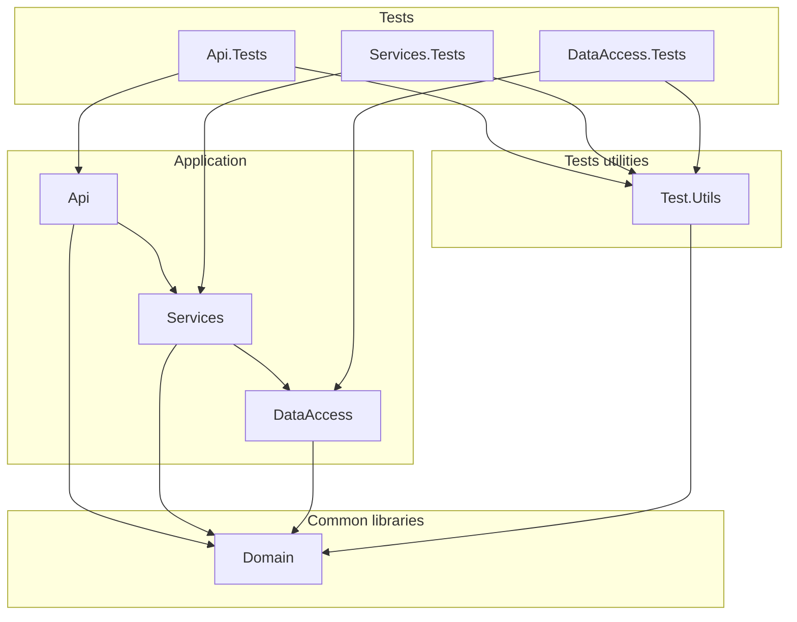

# **Calderilla**

## Overview
**Calderilla** is a .NET 8.0 Azure Function app built using the **Isolated Worker Model**. This architecture allows for greater flexibility, full control over the hosting environment, and enhanced dependency injection capabilities.

### Key Features:
- **.NET 8.0 Function App**: Leverages the latest features and performance improvements in .NET 8.0.
- **Isolated Worker Model**: Offers a decoupled hosting model for better flexibility.  
  [Learn more about the isolated process model](https://learn.microsoft.com/en-us/azure/azure-functions/dotnet-isolated-process-guide?tabs=hostbuilder%2Cwindows).
- **`IHostApplicationBuilder` Support**: Simplifies application startup and configuration.  
  [Read more about `IHostApplicationBuilder`](https://learn.microsoft.com/en-us/azure/azure-functions/dotnet-isolated-process-guide?tabs=ihostapplicationbuilder%2Cwindows#start-up-and-configuration).
- **Dependency Injection**: Implements DI for cleaner, testable, and maintainable code.  
  [Learn more about dependency injection in Azure Functions](https://learn.microsoft.com/en-us/azure/azure-functions/functions-dotnet-dependency-injection).

---

## **Solution Structure**

The solution is organized into multiple projects to ensure separation of concerns, modularity, and scalability:



### 1. **Calderilla.API**
- **Description**: This project contains the HTTP-triggered Azure Functions and serves as the entry point for the application.
- **Responsibilities**:
  - Handles HTTP requests from clients.
  - Orchestrates operations using services from `Calderilla.Services`.
  - Returns responses to clients.
- **Dependencies**:
  - Depends on `Calderilla.Services` for business logic.

---

### 2. **Calderilla.Services**
- **Description**: This project encapsulates the business logic and serves as the intermediary between the API and the data access layer.
- **Responsibilities**:
  - Processes business rules and transformations.
  - Delegates data access responsibilities to `Calderilla.DataAccess`.
- **Dependencies**:
  - Depends on `Calderilla.DataAccess` for data storage operations.

---

### 3. **Calderilla.DataAccess**
- **Description**: This project handles all interactions with Azure Blob Storage.
- **Responsibilities**:
  - Provides an abstraction layer for blob storage operations.
  - Manages data persistence and retrieval.

---

### 4. **Tests Folder**
- **Description**: Contains unit and integration test projects for the solution.
- **Structure**:
  - Test projects are organized to match the corresponding application projects (e.g., `Calderilla.API.Tests`, `Calderilla.Services.Tests`, etc.).
  - Ensures robust test coverage and quality assurance.

---

## **How to Run the Project**
1. **Prerequisites**:
   - [.NET 8.0 SDK](https://dotnet.microsoft.com/download/dotnet/8.0)
   - Visual Studio 2022 or VS Code (with C# extensions)
   - Azure Functions Core Tools (if running locally)
     ```bash
     npm install -g azure-functions-core-tools@4 --unsafe-perm true
     ```

2. **Setup**:
   - Clone the repository:
     ```bash
     git clone https://github.com/your-repo/calderilla.git
     cd calderilla
     ```
   - Configure the `local.settings.json` file in the `Calderilla.API` project to set up your Azure Storage connection string:
     ```json
     {
       "IsEncrypted": false,
       "Values": {
         "AzureWebJobsStorage": "UseDevelopmentStorage=true",
         "FUNCTIONS_WORKER_RUNTIME": "dotnet-isolated"
       }
     }
     ```

3. **Run Locally**:
   - Navigate to the `Calderilla.API` project directory.
   - Start the Azure Functions app:
     ```bash
     func start
     ```

4. **Run Tests**:
   - Execute all tests using the .NET CLI:
     ```bash
     dotnet test
     ```

