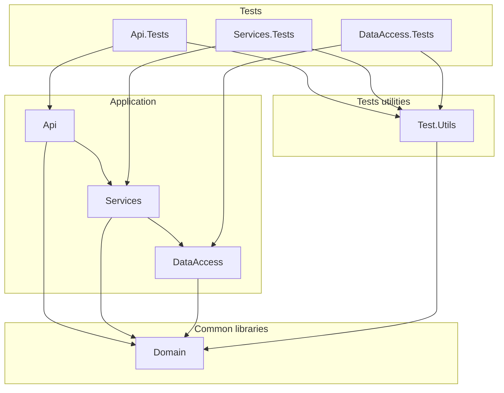

# **Calderilla**

​This directory contains the backend of the solution, implemented as a RESTful API using Azure Functions.

## **Solution Structure**

The solution is organized into multiple projects to ensure separation of concerns, modularity, and scalability:



### 1. **Calderilla.API**
- **Description**: This project contains the HTTP-triggered Azure Functions and serves as the entry point for the application.
- **Responsibilities**:
  - Handles HTTP requests from clients.
  - Orchestrates operations using services from `Calderilla.Services`.
  - Returns responses to clients.
- **Dependencies**:
  - Depends on `Calderilla.Services` for business logic.

For more information, you can refer to the project's README file: [Calderilla.Api](Calderilla.Api/README.md)

### 2. **Calderilla.Services**
- **Description**: This project encapsulates the business logic and serves as the intermediary between the API and the data access layer.
- **Responsibilities**:
  - Processes business rules and transformations.
  - Delegates data access responsibilities to `Calderilla.DataAccess`.
- **Dependencies**:
  - Depends on `Calderilla.DataAccess` for data storage operations.

For more information, you can refer to the project's README file: [Calderilla.Services](Calderilla.Services/README.md)

### 3. **Calderilla.DataAccess**
- **Description**: This project handles all interactions with Azure Blob Storage.
- **Responsibilities**:
  - Provides an abstraction layer for blob storage operations.
  - Manages data persistence and retrieval.

For more information, you can refer to the project's README file: [Calderilla.DataAccess](Calderilla.DataAccess/README.md)

### 4. **Tests Folder**
- **Description**: Contains unit and integration test projects for the solution.
- **Structure**:
  - Test projects are organized to match the corresponding application projects (e.g., `Calderilla.API.Tests`, `Calderilla.Services.Tests`, etc.).
  - Ensures robust test coverage and quality assurance.

---

## **How to Run the Project**
1. **Prerequisites**:
   - [.NET 8.0 SDK](https://dotnet.microsoft.com/download/dotnet/8.0)
   - Visual Studio 2022 or VS Code (with C# extensions)
   - Azure Functions Core Tools (if running locally)
     ```bash
     npm install -g azure-functions-core-tools@4 --unsafe-perm true
     ```

2. **Setup**:
   - Clone the repository:
     ```bash
     git clone https://github.com/your-repo/calderilla.git
     cd calderilla
     ```
   - Configure the `local.settings.json` file in the `Calderilla.API` project to set up your Azure Storage connection string:
     ```json
     {
       "IsEncrypted": false,
       "Values": {
         "AzureWebJobsStorage": "UseDevelopmentStorage=true",
         "FUNCTIONS_WORKER_RUNTIME": "dotnet-isolated"
       }
     }
     ```

3. **Run Locally**:
   - Navigate to the `Calderilla.API` project directory.
   - Start azurite:
     ```bash
     azurite-blob
     ```   
   - Start the Azure Functions app:
     ```bash
     func start
     ```

4. **Run Tests**:
   - Execute all tests using the .NET CLI:
     ```bash
     dotnet test
     ```

**Package.json**:

The package.json file in this project serves as a set of development tools and scripts for working with the API. It defines several npm scripts to:

- Start Azurite Blob storage emulator (azurite:blob)
- Start the Azure Functions host for the API (func:start)
- Run .NET tests for the API (api:test)
- Build the .NET API project (api:build)

This file does not manage the main application code (which is .NET), but provides convenient commands for local development, testing, and running the API.

> ℹ️ **Note:**  
> The `package.json` is especially useful for developers using Visual Studio Code, as it provides convenient scripts for local development and testing. If you are using Visual Studio, some tools like Azurite may start automatically when you run or debug the project, so you might not need to use these npm scripts directly.
